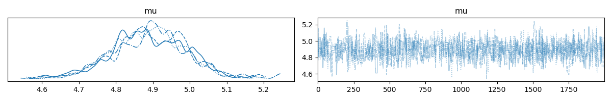

# 📝Pymc 라이브러리 학습 관련 정리
🔗관련 링크: https://ddangchani.github.io/pymc/

## CH1: PyMC and Bayesian

### [실습 기록] PyMC 베이지안 추론 결과 해석 가이드

#### 1. 사후분포 요약 통계량 (Summary Table) 해석
> 모델이 관측 데이터를 학습한 뒤, "진짜 평균($\mu$) 모수가 얼마인가?"라는 질문에 최종 답변을 내린 결과표입니다.

- mean (4.891): 최종 추정 평균값
    - 의미: 모델이 최종적으로 예측한 데이터의 실제 중심점입니다.
    - 특이사항: 사전분포로 정답을 전혀 모르는 상태(pm.Cauchy)에서 시작했으나, 100개의 데이터를 대조해 보며 실제 표본 평균(4.8962)과 거의 일치하는 지점을 완벽하게 역추적해 냈습니다.
- sd (0.099): 모델의 표준편차 (불확실성)
    - 의미: 모델이 스스로 느끼는 판단의 오차 범위입니다. "평균이 4.891인 것 같지만, 위아래로 0.099 정도의 오차 가능성이 있다"고 해석합니다.
    - 해석 팁: 데이터가 많아질수록 이 값(sd)은 줄어들며, 값이 작을수록 모델이 결과에 강한 확신을 가짐을 뜻합니다.
- hdi_3% (4.71) ~ hdi_97% (5.071): 94% 최고밀도구간 (Highest Density Interval)
    - 의미: 베이지안 통계의 핵심 지표로, "진짜 평균값이 4.71과 5.071 사이에 존재할 확률이 정확히 94%다"라는 뜻입니다.
    - 장점: 기존 빈도주의 통계학의 '신뢰구간'보다 훨씬 직관적이고 비즈니스 의사결정에 직결되는 해석을 제공합니다.

 

#### 2. MCMC Trace Plot 그래프 해석
> MCMC(Metropolis-Hastings) 알고리즘이 사후분포 공간을 어떻게 탐색했는지 보여주는 시각적 증거입니다.
 

① 좌측 그래프 (사후분포 곡선, KDE Plot)
- 형태: 가로축 4.89 부근을 중심으로 뾰족하게 솟아오른 종 모양(정규분포)을 띱니다.
- 해석: 데이터 분석 결과, 평균 모수가 4.89에 존재할 확률이 가장 높음을 시각적으로 검증합니다.
- 여러 개의 선이 겹친 이유: PyMC는 신뢰도를 높이기 위해 서로 다른 출발점에서 탐색하는 체인(Chain)을 여러 개(기본 4개) 돌립니다. 4개의 선이 한곳으로 이쁘게 모였다는 것은 "어디서 출발했든 상관없이 4번 모두 동일한 정답(4.89)으로 수렴했다"는 강력한 증거입니다.
  
 

② 우측 그래프 (체인 궤적, Trace Plot)
- 형태: 위아래로 무작위하게 요동치며 가로로 길게 뻗은 '촘촘한 털벌레' 혹은 '털이 숭숭 난 뱀' 모양을 하고 있습니다.
- 해석: 알고리즘이 특정 값에 갇혀 정체되거나 끊기지 않고, 전체 확률 공간을 무작위로 아주 건강하게 잘 훑었다는 뜻입니다.
- 주의할 점: 만약 이 그래프가 지그재그가 아니라 평평한 일직선이거나 계단 모양으로 툭툭 끊긴다면 샘플링 실패(Non-convergence)를 의미하므로, 이 경우 튜닝 파라미터를 조절해야 하는 트러블슈팅이 필요합니다. (현재 결과는 대성공)

