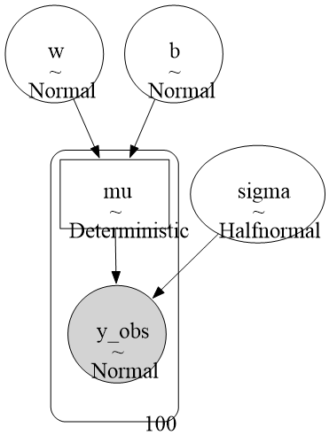
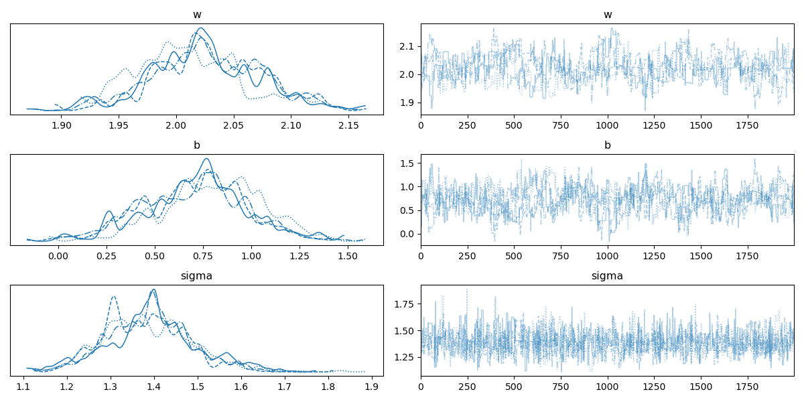

# [TIL] PyMC 베이지안 선형 회귀 결과 분석 및 튜닝 매뉴얼

## 1. 사후분포 요약 통계량 (Summary Table) 해석
가상 데이터의 규칙인 $y = 2.0x + 1.0 + \text{오차}(1.5)$와 비교하여 모델이 모수를 얼마나 잘 추정했는지 검증합니다.

| 모수 (Parameter) | 실제 정답 (True) | 추정 평균 (`mean`) | 94% HDI 구간 (`hdi_3% ~ hdi_97%`) |
| :--- | :---: | :---: | :---: |
| **`w` (기울기)** | `2.0` | **`2.023`** | `1.939 ~ 2.119` |
| **`b` (절편)** | `1.0` | **`0.731`** | `0.235 ~ 1.231` |
| **`sigma` (노이즈 크기)** | `1.5` | **`1.388`** | `1.210 ~ 1.593` |

### 💡 핵심 지표 분석
* **`w` (기울기):** 무작위 노이즈를 뚫고 실제 $X$와 $Y$의 인과관계 핵심 가중치(`2.023`)를 대단히 정밀하게 복원했습니다.
* **`b` (절편):** 무작위 노이즈의 쏠림 현상 때문에 `mean` 자체는 `0.731`로 소폭 낮게 잡혔으나, 베이지안의 핵심인 **94% HDI(Highest Density Interval) 구간 내에 실제 정답인 `1.0`이 안전하게 포함**되어 있으므로 통계적으로 유효하고 성공적인 추론으로 판정합니다.

---

## 1-1. 모델 구조 그래프



<br>

## 2. Trace Plot 시각화 분석


* **좌측 KDE (확률 밀도 함수):** 모든 체인이 단일한 피크(Peak)를 가진 종 모양으로 정렬되어, 추정값의 신뢰도가 높음을 시각적으로 증명합니다.
* **우측 Trace (샘플링 궤적):** 1단계(단일 모수 추정)에 비해 선들이 살짝 거칠고 듬성듬성하게 요동칩니다. 이는 변수가 3개로 확장되면서 샘플링 효율이 다소 저하되었음을 의미하며, 아래의 경고 메시지와 직결됩니다.

---

## 3. 🛠️ 트러블슈팅: MCMC Convergence 경고 해결 (실무 필수)

### 🚨 마주친 경고 메시지
```text
The rhat statistic is larger than 1.01 for some parameters. 
The effective sample size per chain is smaller than 100 for some parameters.
```

#### ❓ 원인 분석 (작동 원리)
- `pm.Metropolis()` 알고리즘은 무작위 걷기(Random Walk) 방식을 기반으로 공간을 탐색합니다.

- 추정할 변수 개수가 1개에서 3개(w, b, sigma)로 늘어나자 공간을 훑는 효율이 떨어져, 독립적인 4개의 체인이 서로 완벽하게 일치하지 못하고 정체 구역이 생겼음을 뜻합니다.

- 복잡한 실무 도메인 모델에 Metropolis를 그대로 쓰면 이 경고 때문에 **사후분포의 신뢰도가 떨어집니다.**

#### 💡 해결책: 고성능 NUTS(No-U-Turn Sampler)로 전환
실무 프로젝트에서는 `Metropolis()` 지정을 과감히 삭제하고, PyMC가 자랑하는 하이엔드 알고리즘인 NUTS를 기본 엔진으로 사용해야 합니다. NUTS는 미분 가이드(HMC)를 받아 확률 공간을 스케이트 타듯 미끄러져 가며 샘플링하므로 **복잡한 고차원 모델도 경고 없이 한방에 해결**합니다.

##### 💻[실무형 권장 샘플링 코드]
```python
with pm.Model() as model:
    # ... 모델 정의 레이어 동일 ...
    
    # step 지정 코드를 삭제하면 PyMC가 연속형 변수에 대해 최적의 NUTS 샘플러를 자동으로 가동합니다.
    trace = pm.sample(draws=1000, tune=1000, return_inferencedata=True)
```

# 🤓[보충 설명] Metropolis 알고리즘 대신 프로젝트에서는 고성능 NUTS(No-U-Turn Sampler) 알고리즘을 사용해야 하는 이유
## 1. Metropolis의 한계: "술 취한 사람의 무작위 걷기"
우리가 앞서 썼던 Metropolis 알고리즘은 다음 장소로 이동할 때 아무 방향이나 무작위로 발걸음을 내딛습니다.

🚩문제점: 변수가 3개, 5개, 10개로 늘어나면(고차원 공간), 눈을 감고 걷는 것과 같아서 정답이 있는 확률 공간을 효율적으로 찾지 못하고 제자리걸음을 하거나 이상한 데서 헤매게 됩니다. (그래서 아까 R-hat 경고 메시지가 뜬 것입니다.)

## 2. HMC (Hamiltonian Monte Carlo): "우주의 중력과 마찰력 이용하기"
이 문제를 해결하기 위해 물리학의 **'해밀토니안 역학(에너지 보존 법칙)'** 가이드를 샘플링에 도입한 것이 HMC입니다.

확률 분포 그래프를 뒤집어서 **굴곡이 있는 미끄럼틀(그릇)** 모양의 공간이라고 상상해 보세요. 확률이 높은 정답 구역은 가장 깊은 골짜기가 됩니다.

- 작동 원리: 확률 공간에 가상의 '공'을 하나 던집니다. 공은 중력에 의해 자연스럽게 확률이 높은 골짜기(정답 구역)를 향해 미끄러져 내려갑니다. 이때 공에 가상의 '운동에너지(속도)'를 무작위로 주어, 골짜기 바닥에만 가만히 멈춰있지 않고 골짜기 벽면을 타고 이리저리 부드럽게 롤러코스터처럼 움직이게 만듭니다.

- 장점: 눈을 감고 무작위로 걷는 게 아니라, **곡면의 기울기(미분값)를 보고 미끄러지듯 이동**하기 때문에 변수가 수십 개로 늘어나도 정답 구역을 번개처럼 빠르게 찾아냅니다.

## ✅3. NUTS (No-U-Turn Sampler): "유턴하기 직전에 멈추는 천재성"
HMC는 엄청나게 빠르고 정확하지만, 치명적인 단점이 있었습니다. 공을 던졌을 때 "이 공을 몇 초 동안 굴려야 하는가?(Step size와 느릅나무 수)"를 인간이 직접 숫자로 튜닝해 줘야 했습니다.

너무 짧게 굴리면 골짜기 근처도 못 가고, 너무 오래 굴리면 골짜기를 지나쳐서 다시 반대편 엉뚱한 곳으로 올라가 버립니다.

NUTS는 이 가상의 공이 골짜기를 통과해 반대편 벽을 타고 올라가다가 **다시 'U턴(유턴)'해서 돌아오기 직전의 타이밍을 수학적으로 알아채서 공을 딱 멈추는 알고리즘**입니다.

결론: 인간이 복잡한 하이퍼파라미터를 튜닝할 필요 없이, **알고리즘이 알아서 최적의 타이밍에 공을 굴리고 멈추기를 반복**하며 완벽한 사후분포 샘플을 뽑아냅니다.

## 🎯 한 줄 요약
"Metropolis는 눈감고 무작위로 기어 다니는 방식이라 변수가 많아지면 뻗어버리지만, NUTS는 확률 공간의 경사면을 따라 롤러코스터를 태우듯 공을 굴려 정답을 사냥하는 방식이다. 따라서 실무에서는 파라미터 튜닝이 필요 없고 고차원에서도 완벽하게 작동하는 NUTS가 무조건 표준이다."