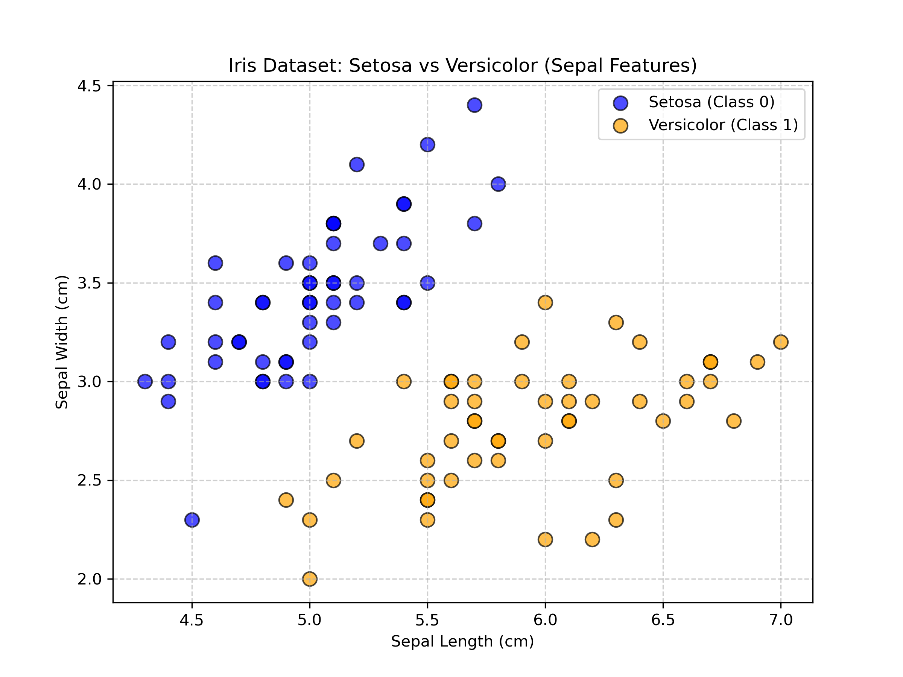
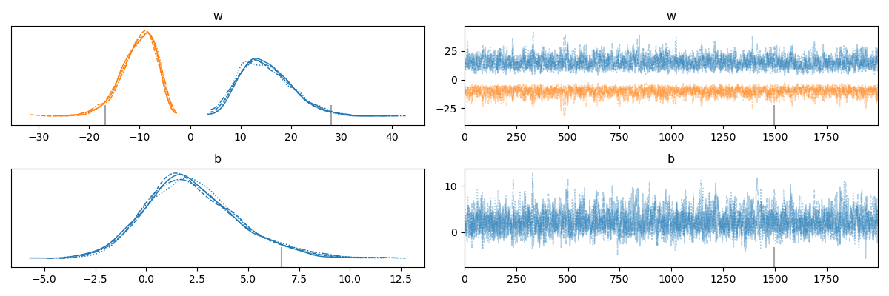

# [TIL] PyMC 베이지안 로지스틱 회귀 분석 (이진 분류)

## 1. 분석 개요

본 분석은 Scikit-learn의 붓꽃(Iris) 데이터셋을 활용하여 두 종(Setosa, Versicolor)을 이진 분류하는 **베이지안 로지스틱 회귀(Bayesian Logistic Regression)** 모델입니다.
분석의 직관성을 위해 2개의 특성(꽃받침 길이, 꽃받침 너비)만을 변수로 사용하였습니다.

## 1-1. 데이터 분포 직관적 이해 (Scatter Plot)

**X축이 꽃받침 길이(Sepal length)**, **Y축이 꽃받침 너비(Sepal width)** 인 2차원 좌표 평면(Scatter Plot)을 그려보면 두 종의 차이가 명확하게 드러납니다.

- **Setosa(0번 종, 파란색):** 대체로 꽃받침 길이는 짧고 너비는 뚱뚱해서 그래프의 **좌측 상단**에 뭉쳐서 점이 찍힙니다.
- **Versicolor(1번 종, 주황색):** 대체로 꽃받침 길이는 길고 너비는 날씬해서 그래프의 **우측 하단**에 뭉쳐져 있습니다.

> ⚠️ **[주의] X축과 Y축은 원인-결과 관계가 아닙니다!**
> 일반적인 수학 1차 함수($y = ax + b$) 그래프에서는 X축이 원인(독립변수), Y축이 결과(종속변수)입니다. 하지만 이 분류 모델의 2차원 산점도에서는 다릅니다.
>
> - **X축 (꽃받침 길이):** 1번 독립변수 ($X_0$)
> - **Y축 (꽃받침 너비):** 2번 독립변수 ($X_1$)
> - **점의 색깔 (종의 종류):** 종속변수 ($Y$, 타겟)
>
> 즉, 이 그래프에서 Y축은 "X로 인해 도출된 결과"가 아니라, **X축과 Y축 모두 붓꽃의 종류(결과)를 맞히기 위해 모델에 입력되는 힌트(원인, 독립변수)**입니다.

여기서 우리가 작성한 로지스틱 회귀 코드의 방정식($z = w_0 \cdot X_0 + w_1 \cdot X_1 + b$)의 역할은 "길이가 길어지면 너비가 변한다"는 식의 관계를 대변하는 선이 아닙니다. 이 2차원 평면 바닥 어디에 울타리를 쳐야 파란색(Setosa)과 주황색(Versicolor) 무리를 완벽하게 가를 수 있을지를 수학적으로 계산해 내는 **'결정 경계선(Decision Boundary)'**을 찾는 것입니다.

### 🧮 핵심 모델 구조 (3단 콤보 작동 원리)

머신러닝과 딥러닝의 기본 뼈대가 되는 로지스틱 회귀는 다음 3단계의 흐름으로 이루어집니다.

**1. 선형 결합 (Linear Combination): 종합 점수 계산**

- **수식:** $z = w_0 \cdot X_0 + w_1 \cdot X_1 + b$
- 현실 세계의 힌트(특성, $X$)들을 그냥 더하는 것이 아니라, 학습된 **중요도(가중치, $w$)**를 곱하고 **기본 핸디캡(절편, $b$)**을 더해 하나의 '종합 점수($z$)'로 묶어내는 수학적 행위입니다.
- 예) `(수능점수 × 0.7) + (내신점수 × 0.3) + 가산점` 처럼, 붓꽃의 길이와 너비가 각각 분류에 미치는 영향력을 고려해 하나의 가공되지 않은 점수(Raw Score)를 만듭니다.

**2. 확률 변환 (시그모이드 함수, Sigmoid): \% 확률로 압축**

- **수식:** $p = \frac{1}{1 + e^{-z}}$
- 선형 결합으로 계산된 점수 $z$는 `-50.2`, `108.5` 등 어떤 숫자든 될 수 있습니다. 하지만 분류를 위해서는 **"이 꽃이 Versicolor일 확률(%)"**이 필요합니다.
- 시그모이드 함수는 무한대로 뻗어 나가는 원시 점수 $z$를 억지로 찌그러뜨려서, **0에서 1 사이(0% ~ 100%)의 확률값($p$)**으로 예쁘게 변환해 주는 곡선입니다.

**3. 가능도 (Likelihood - 베르누이 분포): 최종 분류(동전 던지기)**

- **수식:** $y \sim \text{Bernoulli}(p)$
- 시그모이드가 내뱉은 확률 $p$ (예: 확률 80%)를 기준으로, 동전을 던지듯(앞/뒷면 둘 중 하나만 나오는 베르누이 분포) 0(Setosa)인지 1(Versicolor)인지 최종 판별을 내립니다.

---

## 2. 사후분포 요약 (Summary Table) 해석

터미널에서 도출된 사후분포 요약 통계량(`az.summary`)은 각 특성이 꽃의 분류에 미치는 영향력을 나타냅니다.

| 모수 (Parameter) | 역할 및 의미                         | 해석 방향                                                                   |
| :--------------- | :----------------------------------- | :-------------------------------------------------------------------------- |
| **`w[0]`**       | **첫 번째 특성(꽃받침 길이) 가중치** | 양수라면 꽃받침 길이가 길수록 클래스 1(Versicolor)일 확률이 높아집니다.     |
| **`w[1]`**       | **두 번째 특성(꽃받침 너비) 가중치** | 음수/양수에 따라 해당 특성이 이진 분류에 기여하는 방향과 척도가 결정됩니다. |
| **`b`**          | **절편(Bias)**                       | 기준점이 되는 편향 값입니다.                                                |

---

## 3. Trace Plot 시각화 분석

- **좌측 KDE (확률 밀도 함수):**
  가중치(`w[0]`, `w[1]`)와 절편(`b`)에 대한 사후분포의 형태입니다. 그래프가 매끄러운 단일 종 모양(Peak)을 보인다면, 각 변수가 분류를 위한 최적의 파라미터로 명확하게 추정되었음을 시각적으로 증명합니다.
- **우측 Trace (샘플링 궤적):**
  NUTS 알고리즘이 확률 공간을 탐색한 경로입니다. 체인(Chain)을 형성하는 선들이 넓은 띠 형태로 거칠게 섞여 요동치고 있다면, 공간 정체 없이 안정적이고 완벽한 수렴(Convergence)을 이뤄낸 것입니다.

---

## 4. 💡 실무 꿀팁: 데이터 표준화(Scaling)의 중요성

이번 코드에서는 원본 데이터(`X`)에서 평균을 빼고 표준편차로 나누는 **데이터 표준화(`X_scaled`)** 과정을 거쳤습니다.

### ❓ 베이지안 로지스틱 회귀에서 표준화가 필수인 이유

1. **NUTS 알고리즘의 탐색 속도 향상:**
   특성 간의 단위(Scale)가 다르면 HMC/NUTS 샘플러가 탐색해야 할 확률 공간이 한쪽으로 길게 찌그러지게 됩니다. 표준화를 통해 공간을 둥글게 만들어주면 샘플러가 경사면을 부드럽게 미끄러지며(U-Turn 없이) 훨씬 빠르게 정답 구역에 수렴합니다.
2. **수렴성 경고 완벽 예방:**
   다중 변수를 다룰 때 흔히 발생하는 `R-hat > 1.01` 이나 다이버전스(Divergence) 경고를 방지하며 모델 전체의 안정성을 극대화합니다.
3. **가중치(`w`)의 직관적 비교:**
   표준화가 되어있으면 `w[0]`과 `w[1]`의 절댓값 크기만으로 "어떤 특성이 분류에 더 결정적인 역할을 했는지" 객관적으로 비교할 수 있습니다.

---

## 5. 🎯 결론 및 시사점 (비즈니스/실무 관점)

본 베이지안 로지스틱 회귀 분석을 통해 얻은 가장 핵심적인 시사점은 **불확실성을 내포한 의사결정 체계의 구축**입니다.

### 🔍 베이지안 선형 회귀 vs 로지스틱 회귀 차이점

이전 단계에서 진행한 **선형 회귀**와 이번 **로지스틱 회귀**의 결정적 차이를 이해하는 것이 중요합니다.

| 구분             | 베이지안 선형 회귀 (Linear)            | 베이지안 로지스틱 회귀 (Logistic)    |
| :--------------- | :------------------------------------- | :----------------------------------- |
| **분석 목적**    | **수치 예측** (예: 집값, 매출액)       | **분류** (예: 불량 판정, 종 분류)    |
| **결과값 ($y$)** | 연속적인 숫자 ($-\infty \sim +\infty$) | 이진 결과 (0 또는 1)                 |
| **핵심 구조**    | 선형 결합 결과 그대로 사용             | **시그모이드 함수**로 확률 변환 추가 |
| **가능도 분포**  | 정규 분포 (Normal)                     | **베르누이 분포** (Bernoulli)        |

- **선형 회귀**는 "정답이 몇 점인가?"라는 **직선**을 찾는 과정이고, **로지스틱 회귀**는 힌트를 종합해 "이쪽인가 저쪽인가?"를 결정하는 **울타리(경계선)**를 치는 과정입니다.

### 💡 베이지안 모델의 기대 효과

기존의 전통적인 머신러닝 분류기(Scikit-learn 등)는 "이 데이터는 Versicolor입니다"라고 **하나의 점(Point) 예측**만을 제공합니다. 반면, 베이지안 딥러닝 방식은 다음과 같은 압도적인 장점을 갖습니다.

1. **"모르겠다"고 말할 수 있는 모델:** 특정 데이터가 판단하기 애매한 경계선에 위치해 있을 때, 일반 모델은 억지로 0이나 1로 우겨넣지만, 베이지안 모델은 추정된 확률의 분포(HDI 구간)를 통해 "이번 판단은 신뢰도가 낮으니 사람이 직접 확인해야 합니다"라는 **리스크 관리 지표**를 제공합니다.
2. **블랙박스의 해소 (설명 가능한 AI):** 결과를 도출하기까지 각각의 입력 변수(꽃받침 길이, 너비)가 얼마만큼의 가중치로 기여했는지를 사후분포를 통해 명확히 눈으로 확인할 수 있습니다. 이는 **현업 부서나 경영진을 설득해야 할 때 강력한 수학적 근거**가 됩니다.
3. **소규모 데이터(Small Data)에서의 강점:** 데이터 갯수가 적거나 이상치(Outlier)가 많아 트레이닝이 어려운 상황에서도 사전지식(Prior)을 융합하여 과적합(Overfitting)을 막고 매우 안정적이고 강건한 결과를 도출해 냅니다.
