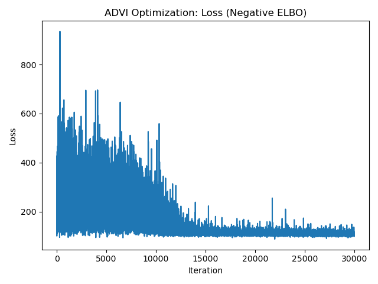

# [TIL] PyMC 베이지안 신경망 (BNN) 및 변분추론 (ADVI)

## 1. 분석 개요

본 분석은 비선형 분류 문제인 **반달 모양 데이터(make_moons)** 를 해결하기 위해, 딥러닝 구조에 베이지안 관점을 결합한 **베이지안 신경망(Bayesian Neural Network, BNN)** 을 구축한 사례입니다.

단순한 수치 예측이나 직선 경계선을 넘어, 복잡한 비선형 공간을 학습하며 모델 가중치의 불확실성을 동시에 추정하는 것이 핵심 목표입니다.

### 🧠 BNN 모델 설계 (구조: 2 -> 5 -> 1)

- **입력층:** 2개의 특성 (X, Y 좌표) - **[전역 시점(World View)]**
- **은닉층 (Hidden Layer):** 5개의 노드 + `tanh` 활성화 함수 - **[각 카메라 시점(Camera View)]**
  - **역할:** 멀티미디어 응용수학의 카메라 시점과 같습니다. 5개의 노드는 5대의 카메라가 서로 다른 각도에서 특정 부분(곡률, 경계 등)만 포착하여 학습하는 것과 같습니다.
  - **왜 `tanh`인가?:** -1에서 1 사이의 값을 가져 음수/양수 신호를 모두 전달할 수 있습니다. 0~1만 다루는 시그모이드보다 은닉층 내에서 정보를 더 다이나믹하게 전달하여 비선형 데이터 학습에 유리합니다.
- **출력층:** 1개의 노드 + `sigmoid` 활성화 함수 (이진 분류) - **[화면 합성 및 최종 판독]**
  - **역할:** 각 카메라(은닉층 노드)에서 보내온 부분적인 특징 보고서들을 합쳐서 "이 데이터는 어떤 무리에 속하는가"를 최종적으로 결정합니다.

## 2. 핵심 알고리즘 및 수학적 설계

### ① Laplace 사전분포 (L1 규제와 Sparsity)

기존 딥러닝의 가중치 초기화와 달리, 각 가중치($w$)에 **Laplace 사전분포**를 부여했습니다.

- **역할:** 가중치 값이 0 근처에 강하게 집중되도록 유도합니다. (L1 Regularization과 유사한 효과)
- **효과:** 불필요한 노드의 가중치를 0으로 밀어내어 모델을 더 단순하고 강건(Robust)하게 만들며 가중치 행렬의 희소성(Sparsity)을 확보합니다.

### ② ADVI (Automatic Differentiation Variational Inference)

변수가 수십~수백 개로 늘어나는 신경망 구조에서 전통적인 MCMC(NUTS)는 속도가 매우 느려집니다. 이를 해결하기 위해 **변분추론(Variational Inference)**인 **ADVI**를 사용했습니다.

- **컴퓨팅 최적화 (Log & Automatic):**
  - **Logarithmic Differentiation:** 확률의 곱셈은 매우 작아져 계산 오류(Underflow)를 일으키기 쉽습니다. ADVI는 **로그(Log)를 취해 곱셈을 덧셈으로 변환**하여 계산 안정성을 확보하고, 로그 미분법을 활용해 최적의 길을 찾습니다.
  - **Automatic:** 과거에는 수학자가 직접 풀어야 했던 복잡한 로그 미분 수식을 PyMC가 **자동(Automatic)**으로 계산해 줍니다.
- **작동 원리:** 사후분포를 직접 샘플링하는 대신, 우리가 다루기 쉬운 분포(예: 정규 분포)를 사후분포에 최대한 가까워지도록 '최적화(Optimization)'하는 방식입니다.
- **장점:** 딥러닝의 경사하강법(Gradient Descent)처럼 작동하므로 고차원 모델에서도 압도적인 속도를 자랑합니다.
- **시각적 차이 (왜 '털벌레' 그래프가 없는가?):**
  - **NUTS(샘플링):** 술 취한 사람(또는 공)이 돌아다닌 '길'을 기록하므로 촘촘한 궤적(Trace)이 남습니다.
  - **ADVI(최적화):** 분포 자체를 정답에 밀착시키는 과정이므로, 이동 궤적 대신 정답과의 거리를 나타내는 **손실 함수(Loss) 그래프**가 출력됩니다.

---

## 3. 알고리즘의 진화 과정 (요약)

이 학습 과정은 단순히 기술을 배우는 것이 아니라, 데이터의 복잡도에 따라 도구가 어떻게 진화했는지를 보여줍니다.

1.  **Metropolis (MH):** 가장 기본적인 샘플링. 하지만 'Random Walk' 방식이라 변수가 많아지면 방향을 잃고 정확도가 급락함.
2.  **NUTS:** MH의 단점을 보완하기 위해 '경사면(Gradient)'을 타고 이동함. 고차원에서도 정확한 답을 찾지만, 수천 개의 변수를 가진 신경망에서는 여전히 속도가 느림.
3.  **Bayesian Neural Network (BNN):** 반달 모양 데이터처럼 선형/로지스틱 회귀가 해결할 수 없는 **비선형성**을 해결하기 위해 도입된 '신경망' 구조.
4.  **ADVI:** 신경망의 수많은 가중치를 빠르게 계산하기 위해 '샘플링'을 '최적화' 문제로 치환하여 **속도를 극대화**한 엔진.

---

## 4. 학습 결과 및 시각화 분석

### 📈 ADVI 손실 함수 (Negative ELBO)

ADVI 학습 시 출력되는 `approx.hist` 그래프는 모델이 얼마나 잘 수렴했는지 보여주는 지표입니다.

- **해석 (Gradient Flattening):**
  - Iteration(반복 횟수)이 진행됨에 따라 손실값(Loss)이 급격히 감소합니다.
  - 정답 분포에 가까워질수록 **미분 기울기(Gradient)가 점점 평탄화**되며, 최종적으로 그래프 바닥이 수평을 이루게 됩니다.
  - 이 평탄한 구간이 바로 모델이 최적의 상태에 도달했음을 의미하는 **수렴(Convergence)** 지점입니다.

### 📊 가중치 앙상블 (Ensemble)

`approx.sample(draws=1000)`을 통해 학습된 근사 분포에서 1,000개의 가중치 세트를 추출했습니다.

- **시사점:** 고정된 하나의 가중치가 아니라 **1,000개의 서로 다른 가중치 시나리오**를 갖게 된 것입니다. 새로운 데이터를 예측할 때 1,000번의 예측을 수행하고 그 평균과 분산을 구함으로써, 모델이 해당 데이터에 대해 **"얼마나 확신하는지(불확실성)"**를 측정할 수 있게 됩니다.

---

## 4. 💡 실무 적용 포인트

1.  **비선형 문제 해결:** 선형 로지스틱 회귀로는 풀 수 없는 복잡한 경계선(반달 모양 등)을 신경망 층을 쌓음으로써 해결 가능합니다.
2.  **과적합 방지:** Laplace 사전분포를 통한 가중치 규제는 모델의 복잡도를 낮춰 **데이터가 부족한 상황에서도 신경망이 노이즈를 과하게 학습(Overfitting)하는 것을 방지**합니다.
3.  **대규모 확장성:** 변분추론(ADVI) 덕분에 복잡한 딥러닝 구조에서도 베이지안의 강력한 불확실성 추정 기능을 포기하지 않고 사용할 수 있습니다.
